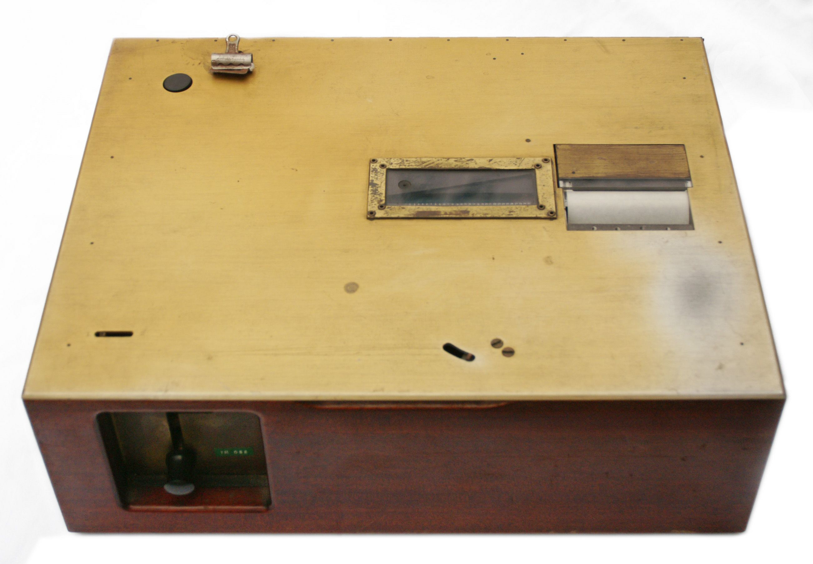
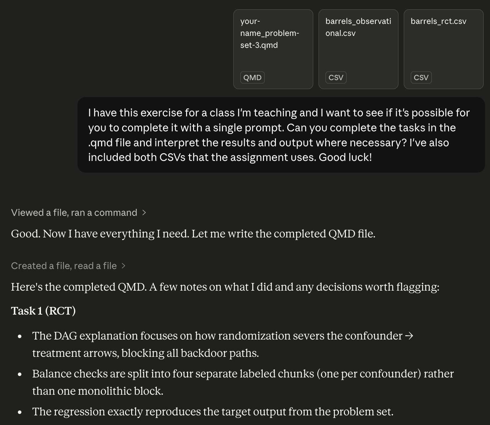
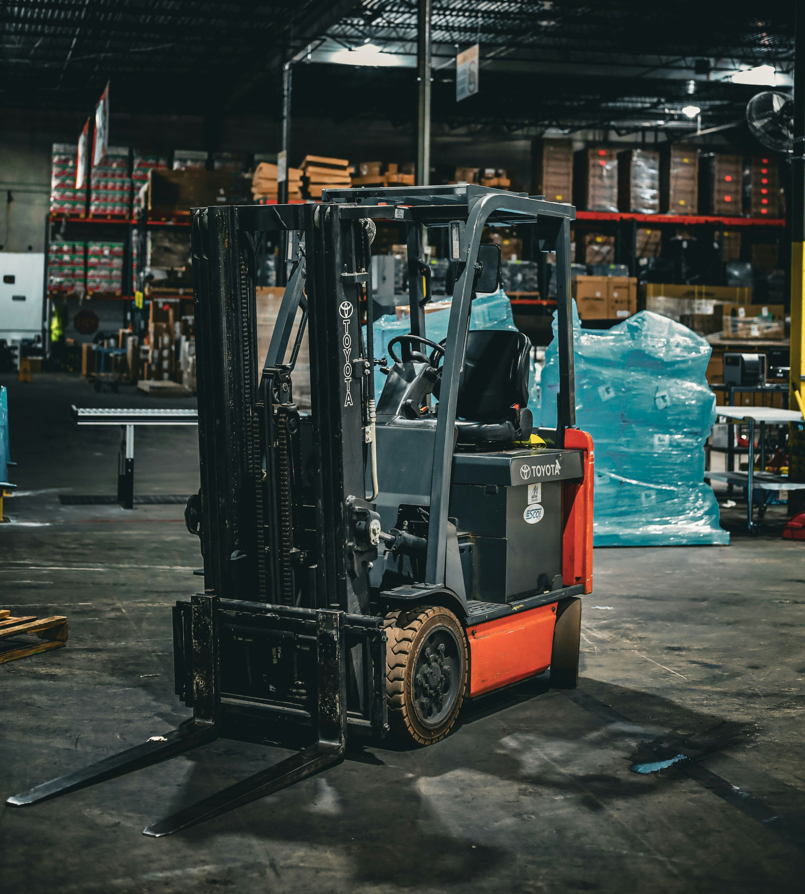
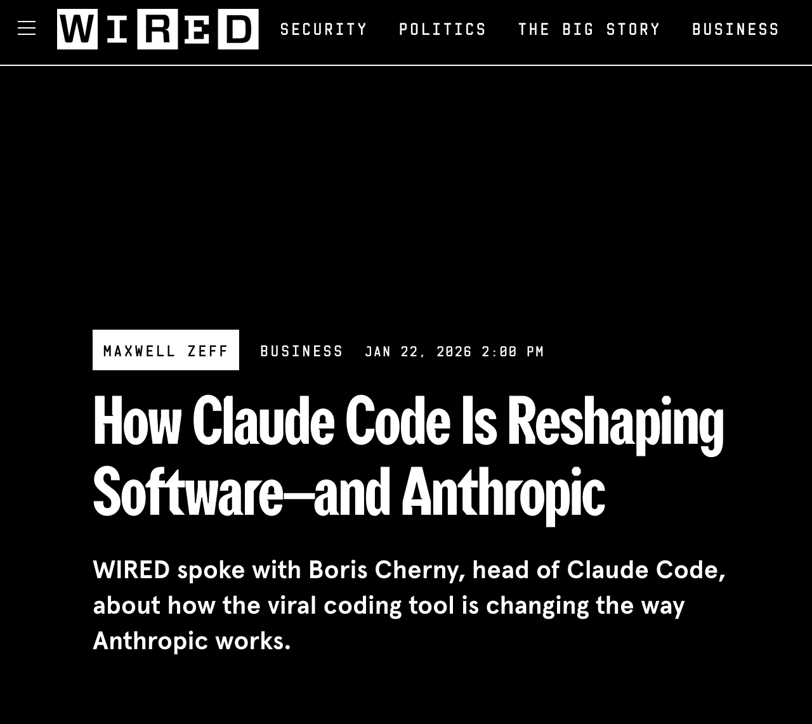
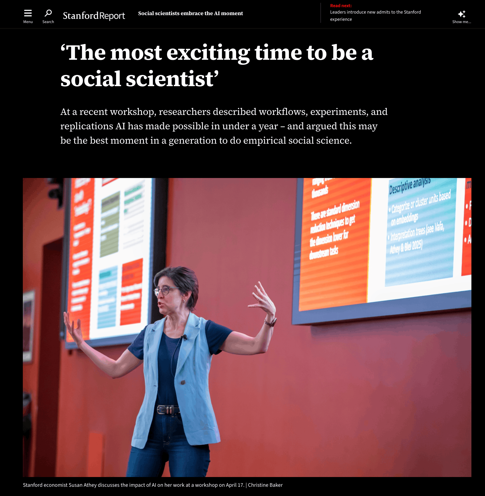
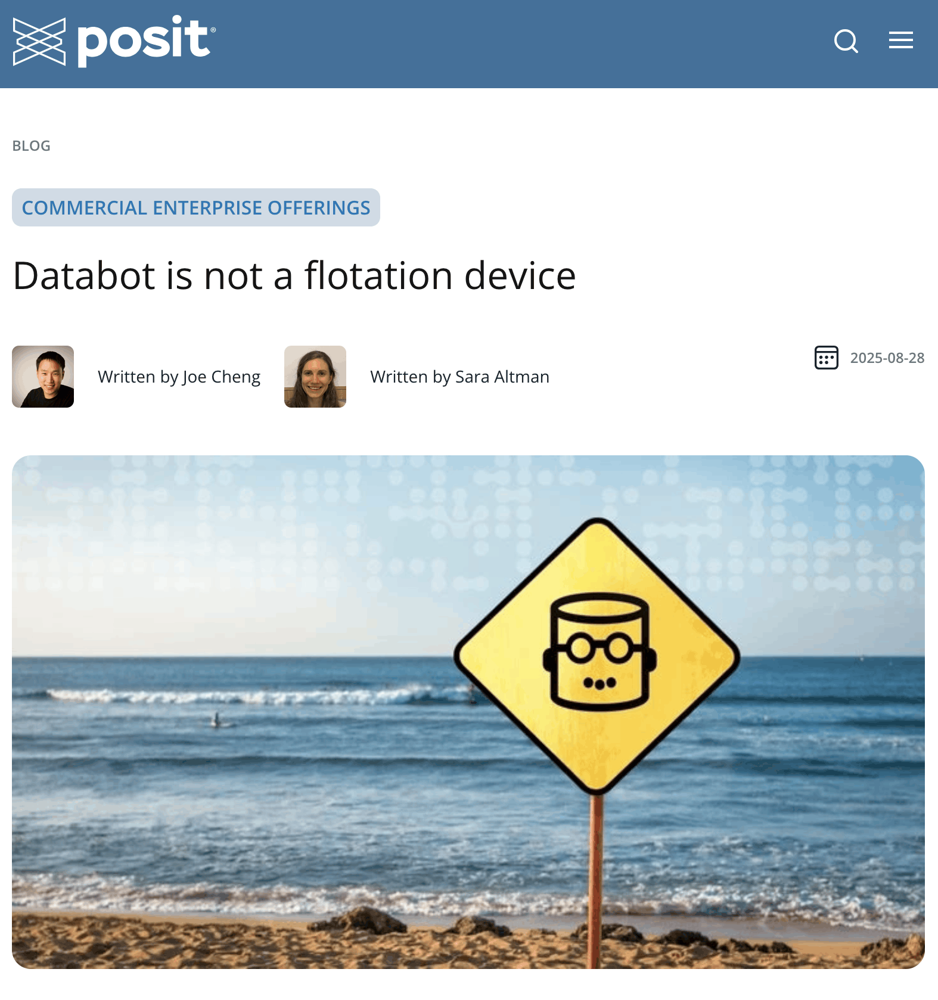
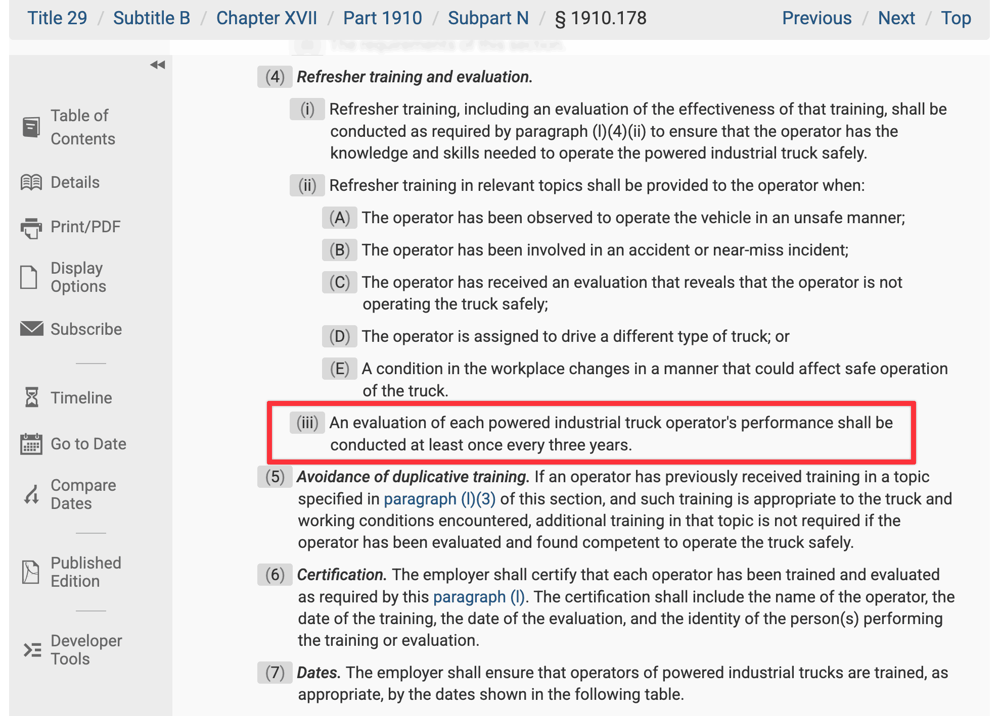

# My AI hypocrisy {background-color='' background-image='img/background-hex-shapes.svg' background-opacity='0.5'}

## {background-image="img/chatgpt-fake-final-project.png" background-size="contain"}

## {background-image="img/null-worlds.png" background-size="contain"}

# Forklifts in weight rooms {background-color='' background-image='img/background-hex-shapes.svg' background-opacity='0.5'}

## Retrieval strength, programmed instruction, and performance

:::: {.columns}

::: {.column .fragment}

:::

::: {.column .fragment}

:::

::::

<!-- https://en.wikipedia.org/wiki/Teaching_machine#/media/File:Skinner_teaching_machine_01.jpg -->
<!-- https://design.duolingo.com/illustration/duo#perspective -->

## Storage strength, desirable difficulties, and learning

:::: {.columns}

::: {.column width="55%"}

::: {.fragment}
> "the conditions that produce the most errors during acquisition are often the very conditions that produce the most learning"

:::{style="font-size: 0.4em; margin-bottom: 3em"}
[@SoderstromBjork2015, 176]
:::
:::

::: {.fragment}
Desirable difficulties deliberately slow down learning:

- Spaced practice
- Interleaving
- Generation

:::{style="font-size: 0.4em"}
[@BjorkBjork2011]
:::
:::

:::

::: {.column width="45%"}

:::

::::

## LLMs and generation

:::: {.columns}

::: {.column width="60%"}

:::

::: {.column width="40%"}
::: {style="font-size: 1.5em;"}
[LLMs provide on-demand retrieval]{.fragment}

\ 

[Human generation replaced with machine generation]{.fragment}

\ 

[Answer Machines]{.fragment}
:::
:::

::::

##

:::: {.columns}

::: {.column}

:::

::: {.column}
::: {style="font-size: 1.6em"}
> "Using ChatGPT to complete assignments is like bringing a forklift into the weight room; you will never improve your cognitive fitness that way."
:::

:::{style="font-size: 0.7em; margin-top: 1.5em;"}
[@Chiang2024]
:::
:::

::::

<!-- Photo by [Jhonatan Londono](https://unsplash.com/@jhonjhon1995) on [Unsplash](https://unsplash.com/photos/a-forklift-parked-inside-of-a-warehouse-_FF8CJbcios)      -->

# Forklifts outside weight rooms {background-color='' background-image='img/background-hex-shapes.svg' background-opacity='0.5'}

## Forklifts *are* useful though

:::: {.columns}

::: {.column}

:::

::: {.column}

::: {.r-stack}

{.fragment .current-visible}

{.fragment .current-visible}

{.fragment .current-visible}

{.fragment .current-visible}

:::

:::

::::

## Forklifts are dangerous

:::: {.columns}

::: {.column}
::: {style="font-size: 1.1em"}
> "In my 30-year career writing software professionally, Databot is both the most exciting software I’ve worked on, and also the most dangerous."
>
>—Joe Cheng, Posit CTO
:::

::: {style="font-size: 1.1em"}
> "**to use Databot effectively and safely, you still need the skills of a data scientist**: background and domain knowledge, data analysis expertise, and coding ability."
:::

:::

::: {.column}

:::

::::

## {.center}

::: {style="font-size: 2em"}
When you know what you're doing, LLMs are powerful.
:::

## {.center}

::: {style="font-size: 2em"}
You cannot LLM your way into durable domain knowledge, data analysis expertise, or coding ability—that still requires some struggle
:::

# Maintaining forklift skills {background-color='' background-image='img/background-hex-shapes.svg' background-opacity='0.5'}

## 29 CFR §1910.178

## Continue learning with deliberate friction

:::: {.columns}

::: {.column .fragment}
::: {style="font-size: 1.3em"}
Even if you know what you're doing, there's value in slowing down and purposely introducing Bjork-style desirable difficulties into your workflow.
:::
:::

::: {.column .fragment}
::: {style="font-size: 1.3em" .incremental}
Some of my strategies:

- Give Claude Code subsets of my data and code, then implement manually
- Treat LLM output like a StackOverflow answer or random blog post—sometimes explicitly
- Use the `learning-opportunities` and `learning-goal` Claude Code skills
:::
:::

::::

# Use LLMs! (I do!) But don't sacrifice learning {background-color='' background-image='img/background-hex-shapes.svg' background-opacity='0.5'}
